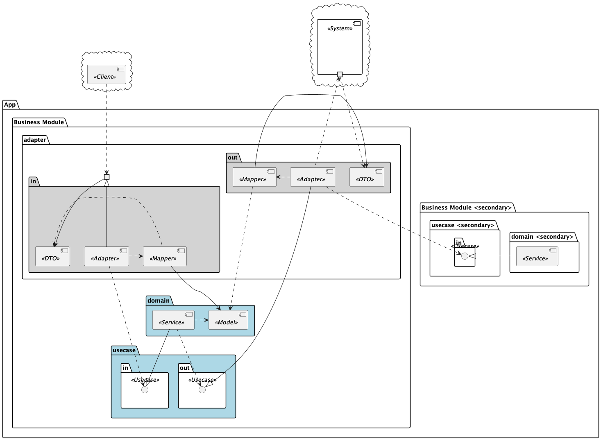

# CarboNata Plate

App to export prometheus data, calculate CO2 costs and push it to Camunda Optimize [Variable Ingestion API](https://docs.camunda.io/optimize/apis-tools/optimize-api/external-variable-ingestion/).

## 🏗Architecture

#### Building Block View

The [building block view](https://docs.arc42.org/section-5/) image below shows a stereotypical static decomposition of a system using Clean Architecture into building blocks as well as their dependencies.

*Building Block View of clean architecture*

## Configuration

Configure the application using [application.yml](./src/main/resources/application.yml).
